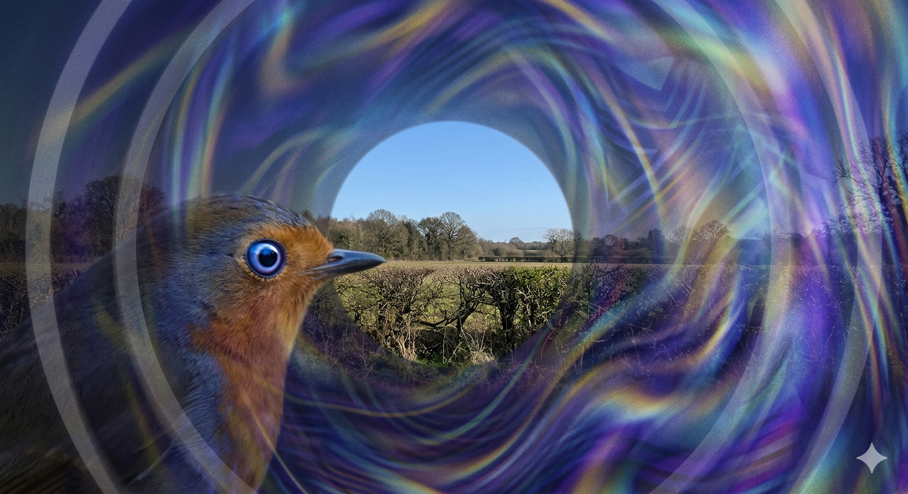
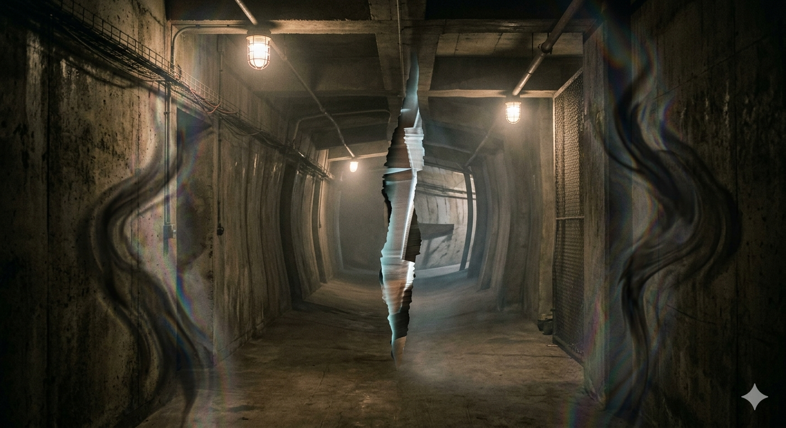

## Hyperspectral

  

## Magnetoreception

  

  

- [Similar but not exact](https://share.google/aimode/jlCs0BHZjhPoYzlPn). More of a combination of both *magnetoreception* images and not one or the other.
- When observing what more closely resembled image 2, the first thought was Schrodinger's cat. 

  

**Note**: This internal visualization (and sidenote, if possible, verify how to figure out the "Step" technique?)

---

If [k3]() includes the setup that bypasses authentication, how to personalize and use [AI]() without exception? Otherwise, how to access your own container and update the `privileges`?
